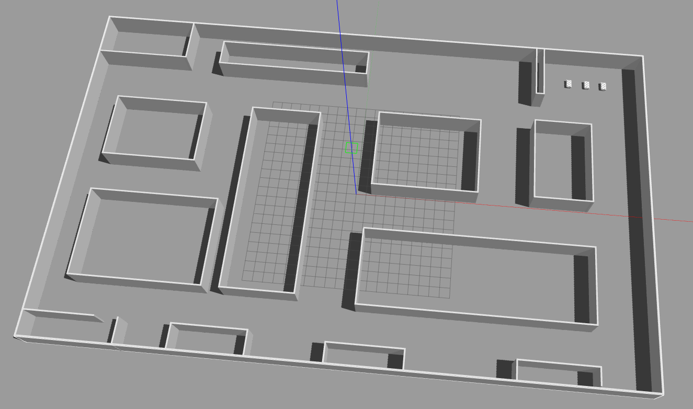
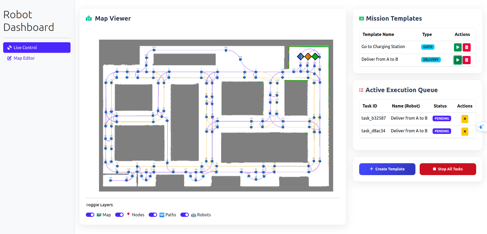
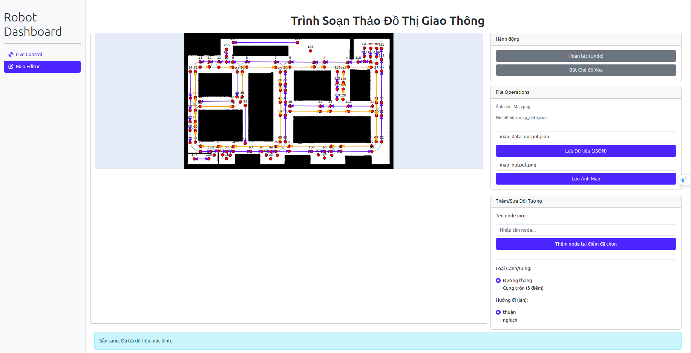

# 🧠 Multi-Robot MiR Control with Reinforcement Learning

Dự án này mô phỏng và điều khiển nhiều robot MiR (Mobile Industrial Robot) sử dụng thuật toán học tăng cường (PPO), hỗ trợ giao diện điều khiển trực quan qua Dashboard và chỉnh sửa bản đồ qua công cụ đồ thị.

---

## 📹 Demo Video

[](https://www.youtube.com/watch?v=YOUTUBE_VIDEO_ID_HERE)

---

## 📦 Setup

```bash
# Tạo workspace
mkdir -p ~/catkin_ws/src 
cd ~/catkin_ws/src/

# Clone mã nguồn chính
git clone -b noetic https://github.com/DFKI-NI/mir_robot.git

# Clone package multi_robot (thay bằng repo thật của bạn)
git clone https://github.com/YOUR_USERNAME/multi_mir_robot.git

# Cài đặt ROS và các phụ thuộc
sudo apt-get update -qq
sudo apt-get install -qq -y python-rosdep
sudo rosdep init
rosdep update --include-eol-distros
rosdep install --from-paths ./ -i -y --rosdistro noetic

# Build workspace
source /opt/ros/noetic/setup.bash
cd ~/catkin_ws
catkin_make -DCMAKE_BUILD_TYPE=RelWithDebugInfo
```
## 🧪 Huấn luyện robot (Train)
```bash
  cd ~/catkin_ws
  catkin_make
  source ~/catkin_ws/devel/setup.bash
  
  # Terminal 1: Chạy mô phỏng Gazebo
  roslaunch multi_mir_gazebo multi_robot_simulation.launch
  
  # Terminal 2: Chạy mô hình đã train
  source ~/catkin_ws/devel/setup.bash
  roslaunch mir_control run.launch

```
## ▶️ Chạy robot đã huấn luyện (Run)
```bash
  cd ~/catkin_ws
  catkin_make
  source ~/catkin_ws/devel/setup.bash
  
  # Terminal 1: Chạy mô phỏng Gazebo
  roslaunch multi_mir_gazebo multi_robot_simulation.launch
  
  # Terminal 2: Chạy mô hình đã train
  source ~/catkin_ws/devel/setup.bash
  roslaunch mir_control run.launch

```

### có thẻ thực hiện chỉnh sửa Map bằng graph_editor.py hoặc truy cập dashboard để chỉnh sửa

## 🛠 chạy khởi đầu với dashboard
```bash
  cd ~/catkin_ws
  catkin_make
  source ~/catkin_ws/devel/setup.bash
  python3 src/multi_mir_robot/mir_control/multi_robot_dashboard/app.py
# → Truy cập trình duyệt tại địa chỉ hiển thị (mặc định là http://localhost:8050) và thực hiện kết nối điều khiển 
```




